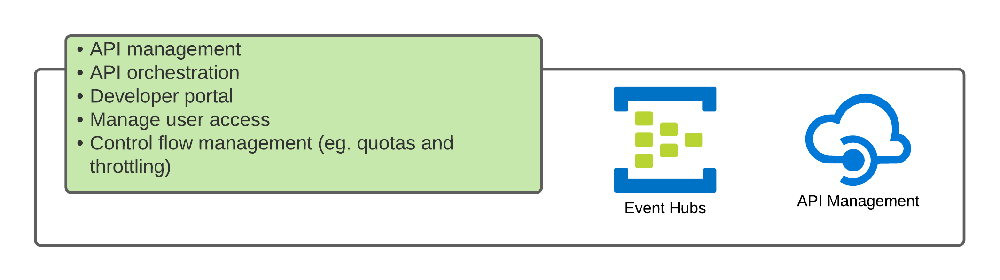

# Introduction

API management service (APIM) enables the management and access to APIs. It controls the flow of traffic and the orchestration of backend calls. It can manage quota limits and throttle calls where required which helps tune your service across consumers.

## Security

We can protect the APIM from back door access by ensuring that the request's source came from the Azure Front Door. We do this by configuring Azure Front Door traffic to add an identifier to the request header and configuring APIM to restrict request access to the Azure Front Door IP and header identifier.

To further control and protect the APIM by housing it on a virtual network and fronting it with a public access point such as an application gateway or external load balancer, which would allow us to control the network traffic and force routing to network virtual appliances (NVA).

## Monitoring

APIM can stream all events into an Event hub, redirecting the output to one of many different resources, eg. storage, log analytics, and stream analytics.

