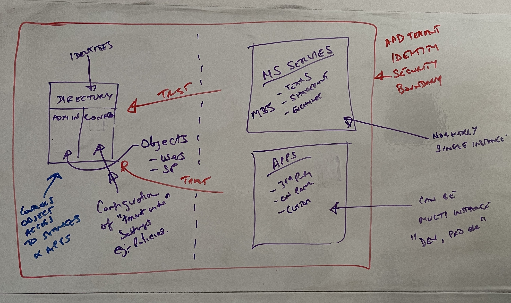
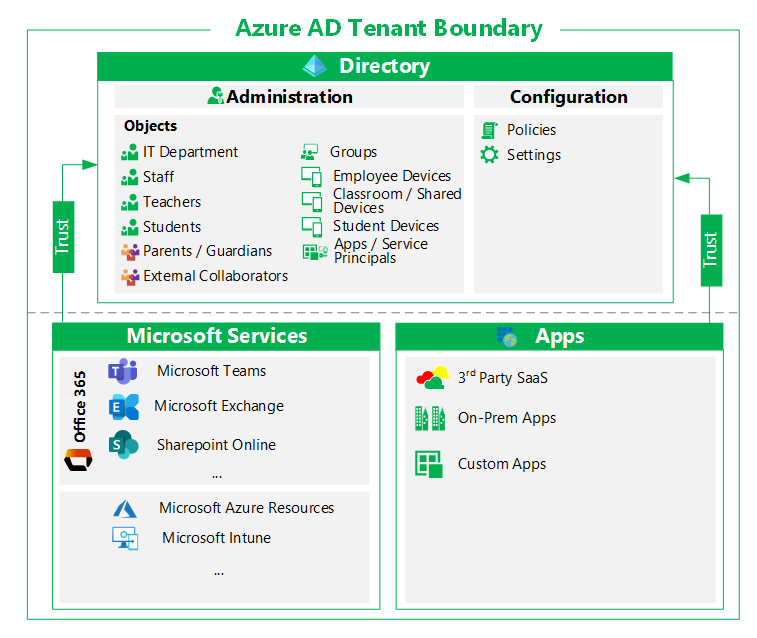

# Introduction

Azure Active Directory is **non-regional**.  [source](https://azure.microsoft.com/en-gb/global-infrastructure/services/?products=active-directory)

## What is a tenant?

A tenant is a collection of:

- identities
- services
- applications

