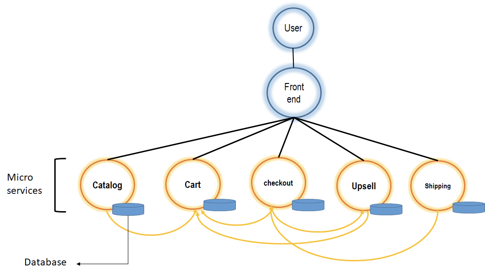
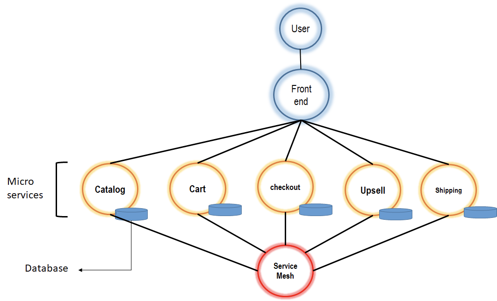

# Introduction

Azure areas to study are:

- Azure accounts and subscriptions
- Azure portal
- Azure marketplace
- Azure APIs and CLIs
- Azure resource manager
- Azure monitor
- Azure regions and datacentres
- Azure SLA, compliance and trust

## What is "cloud native"?

According to the Cloud Native Computing Foundation (CNCF)

- containers
- microservices
- orchestration
- ci/cd
- declarative api (intent not prescriptive, request outcome)
- immutable infrastructure

### What is "service mesh"?

Consider 5 micro-services communicating with each other against:

Against all 5 micro-services communicating with a broker like an api gateway:

