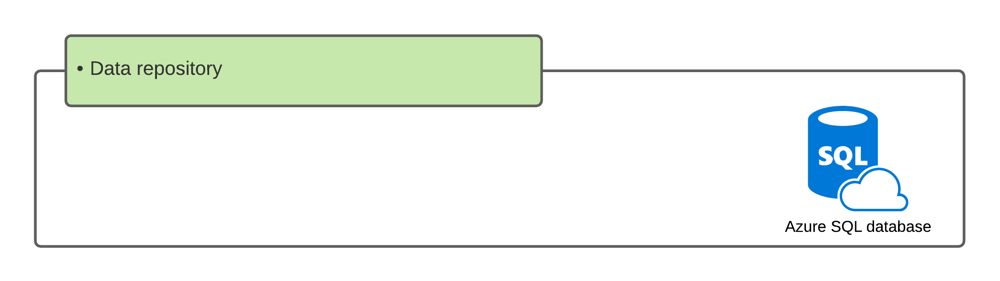

# Introduction

The storage repository for all transactions of the microservice.

## Availability

The database is set up as part of a failover group.  This creates a duplicate database in a different region.  The data is replicated in near realtime and in the event of database failure, the database will failover to the backup database.

Applications are unaware of the change as the connection string remains the same and the failover is handled by the service fabric.

## Backup schedule

The database backup process is part of the failover service:

- Any point in time over the last seven days
- Four weekly backups
- One monthly back
- One yearly backup

[source](https://docs.microsoft.com/en-us/azure/azure-sql/database/business-continuity-high-availability-disaster-recover-hadr-overview)