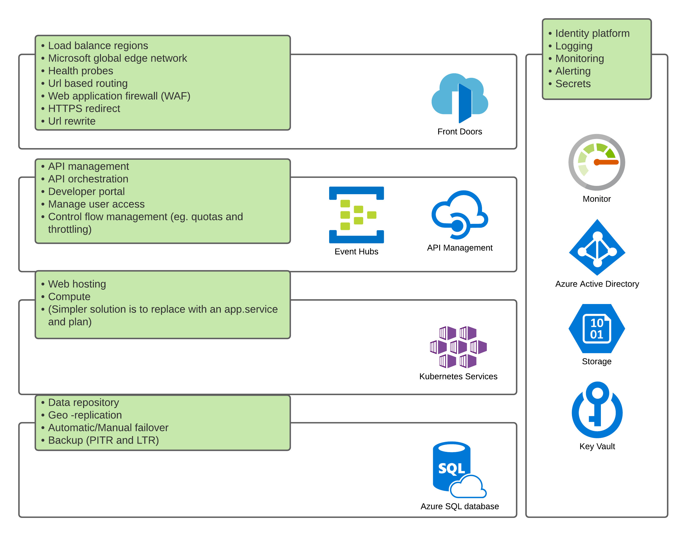
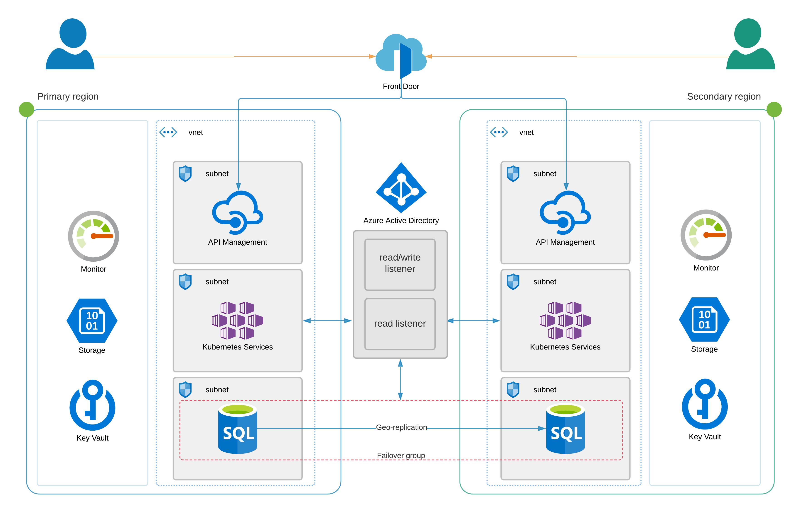
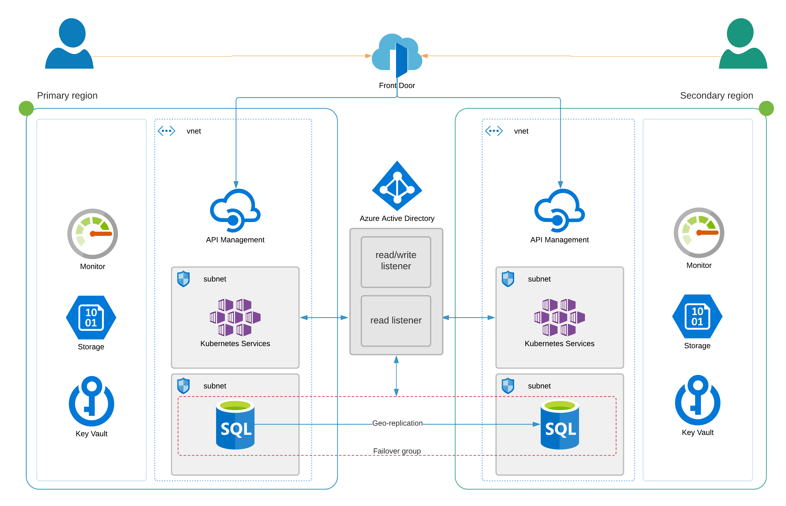

# Introduction

This solution does not solve all issues that may arise from a clients requirements. It is designed to enable architectural flexibility to be upgraded, downgraded or integrated into with new architectural building blocks.

This document attempts to explain what the current architectural building blocks are; the advantages, disadvantages and limitations; areas to consider for the future.

The implementation is an example framework from which to add and remove components depending on the requirements.

An example of this is placing the API management service in a virtual network:

A simpler - and cheaper - solution would be hosting the APIM outside of a virtual network:

This is further discussed in the [APIM](./apim.md) section.

## Sources

[Azure compliance offerings](https://docs.microsoft.com/en-us/azure/compliance/offerings/)
[Azure compliance documentation](https://docs.microsoft.com/en-gb/azure/compliance/)
[Infrastructure security](https://docs.microsoft.com/en-us/azure/security/fundamentals/infrastructure)
[Datacentre Physical security](https://docs.microsoft.com/en-us/azure/security/fundamentals/physical-security)
[Azure geographies](https://azure.microsoft.com/en-us/global-infrastructure/geographies/)
