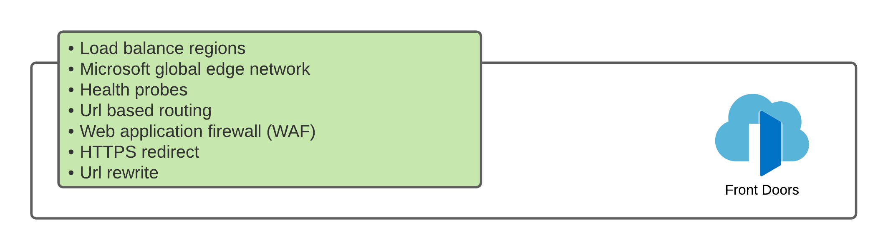

# Introduction

Azure Front door is a global routing agent that enables load balancing between regions. The resource sits on the Microsoft global edge network and acts as a gateway to the Microsoft backbone network, ensuring secure and fast traffic transmission.

## Security

This resource monitors the health of its backend pool and directs traffic according to the configured rules. For example, if a backend pool like a region is down, it will route traffic to a backup region without the consumer being alerted that something has changed.

Traffic can also be configured to be re-route based on other rules.  For example, to the closest geographical region for faster response times for global services.

Azure Front Door contains an integrated web application firewall (WAF) which protects against common [OWASP](https://owasp.org/www-project-top-ten/) vulnerabilities and a basic level of distributed denial of service (DDOS) attacks which can be enhanced at a cost

## Monitoring

All diagnostics and access logs are streamed to a log workspace from which alerts are configured.

[source](https://docs.microsoft.com/en-us/azure/frontdoor/front-door-faq)