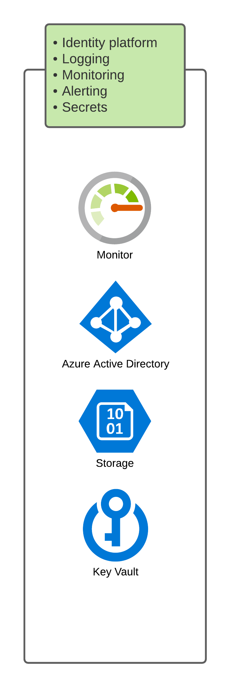

# Introduction

The microservices rely on `Azure identity platform` for token and identity services.

Application performance metrics are tracked through `Azure application insights` and logging and auditing through `Log analytics workspace`.  This allows for streaming of logs and audits to a queryable location from where alerts will be configured.

